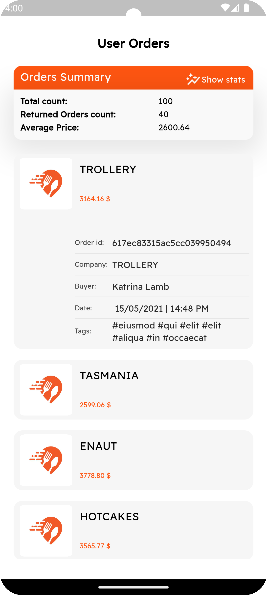
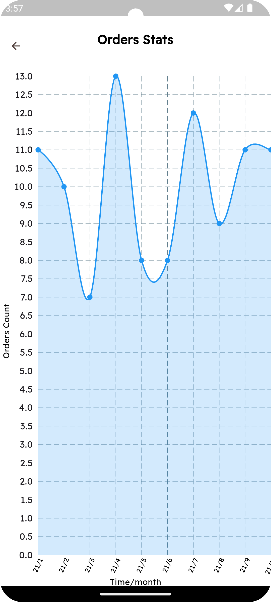
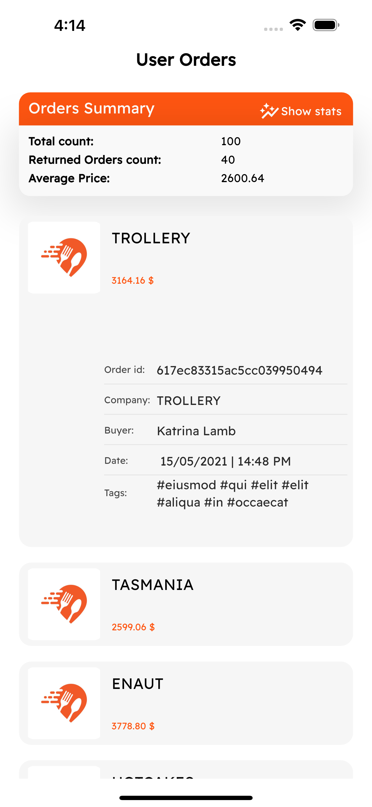
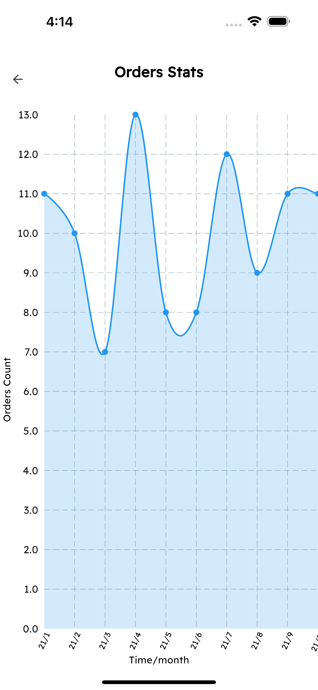
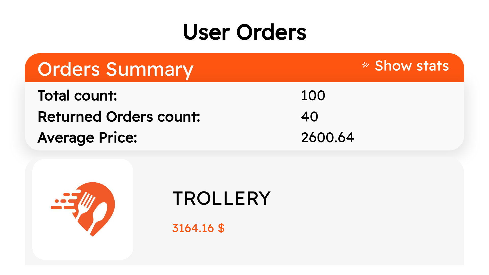
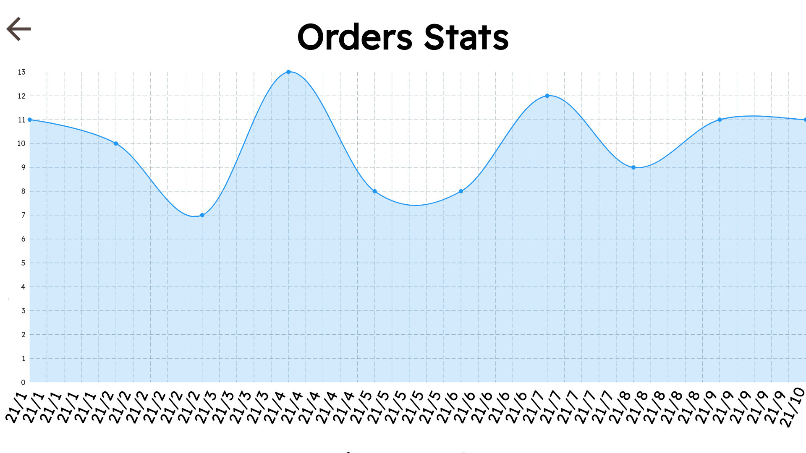

# E-commerce Order Insights App Challenge

This Flutter app provides insights into e-commerce order data by parsing a local JSON
file (`ORDERS.JSON`) and displaying key metrics and a graphical representation of order trends.

## Features

* **Numeric Metrics:** Displays total order count, average order price, and the number of returns.
* **Order Trend Graph:** Visualizes the number of orders over time using a line chart.
* **Cross-Platform:** Works on iOS, Android, and the web.

1. **Prerequisites:**
    * Flutter SDK installed and configured.
    * An IDE like Android Studio or VS Code with Flutter extensions.

2. **Installation:**
    * Clone this repository: `git clone`
    * Install dependencies: `flutter pub get`
    * Run `build_runner` with `dart run build_runner build`

3. **Running the app:**
    * Connect a device or start an emulator/simulator.
    * Run the app: `flutter run`

## Usage

1. **Metrics Screen:**
    * Upon launching the app, you'll see the "Order Insights" screen displaying:
        * Total Orders
        * Average Price
        * Number of Returns
        * Every order details

2. **Graph Screen:**
    * Navigate to the graph screen.
    * View the line chart representing the number of orders over time.

## Screenshots

1. **Android**

   -  
   -  

2**iOS**

   -  
   -  

3**web**

   -  
   -  
